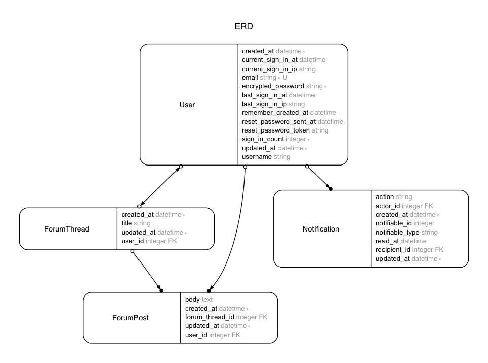

# Notifiable app

In this app, I will build the notification functionality and more in a forum app.
I started from [gorails-screencasts/gorails-episode-124-notifications](https://github.com/gorails-screencasts/gorails-episode-124-notifications)'s
sample app as a base.

---

## Dependencies
- Ruby 2.3.1
- Rails 5.0.1
- Turbolinks
- Devise
- [Bootstrap 4](https://v4-alpha.getbootstrap.com/getting-started/introduction/)
- [jch/html-pipeline](https://github.com/jch/html-pipeline) - HTML processing filters and utilities
- [NextStepWebs/simplemde-markdown-editor](https://github.com/NextStepWebs/simplemde-markdown-editor) - A simple, beautiful, and embeddable JavaScript Markdown editor
- and much more

---

## Database structure



---

## Notification system

#### Model
- polymorphic `Notification` model

#### View
- By convention, an appropriate HTML partial is rendered from:
  + `app/views/notifications/<plural model name>/_<notification action name>`

---

## Turbolinks considerations

#### Notification unread count
- After messing with both approaches mentioned below, I decided to use `Turbolinks.clearCache` because
it makes things simple and working perfectly.

- A: [Turbolinks.clearCache](https://github.com/turbolinks/turbolinks#turbolinksclearcache)

```
Turbolinks.clearCache()
```

- B: [Persisting Elements Across Page Loads](https://github.com/turbolinks/turbolinks#persisting-elements-across-page-loads)

```
<div id="cart-counter" data-turbolinks-permanent>1 item</div>
```

#### Third party JS libraries

```js
App.markdownEditor.init = () => {
  // turbolinks:before-cache fires before Turbolinks saves the current page to cache.
  // https://github.com/turbolinks/turbolinks#full-list-of-events
  document.addEventListener('turbolinks:before-cache', () => {
    if (App.simplemde) { teardown() }
  })

  document.addEventListener('turbolinks:load', () => {
    setup()
  })
  //...
```

---

## Formatting text input

- [rails/ActionView/Helpers/TextHelper/simple_format](http://apidock.com/rails/ActionView/Helpers/TextHelper/simple_format)
- [jch/html-pipeline](https://github.com/jch/html-pipeline) - HTML processing filters and utilities

---

## Some techniques

#### Generate DOM id string in the view
- [rails/ActionView/RecordIdentifier/dom_id](http://apidock.com/rails/ActionView/RecordIdentifier/dom_id)

#### Jumping to a record using anchor and dom_id
- [https://gist.github.com/mnishiguchi/a47c9f2391271f184dadcd5cbdabae5b](https://gist.github.com/mnishiguchi/a47c9f2391271f184dadcd5cbdabae5b)

#### [Active Record Nested Attributes](http://api.rubyonrails.org/classes/ActiveRecord/NestedAttributes/ClassMethods.html)
- [Validating the presence of a parent model](http://api.rubyonrails.org/classes/ActiveRecord/NestedAttributes/ClassMethods.html#module-ActiveRecord::NestedAttributes::ClassMethods-label-Validating+the+presence+of+a+parent+model)
- [gist](https://gist.github.com/mnishiguchi/1206840d369056a3075421005d6f8dc4)

---

## References

- [gorails-screencasts/gorails-episode-124-notifications](https://github.com/gorails-screencasts/gorails-episode-124-notifications)
